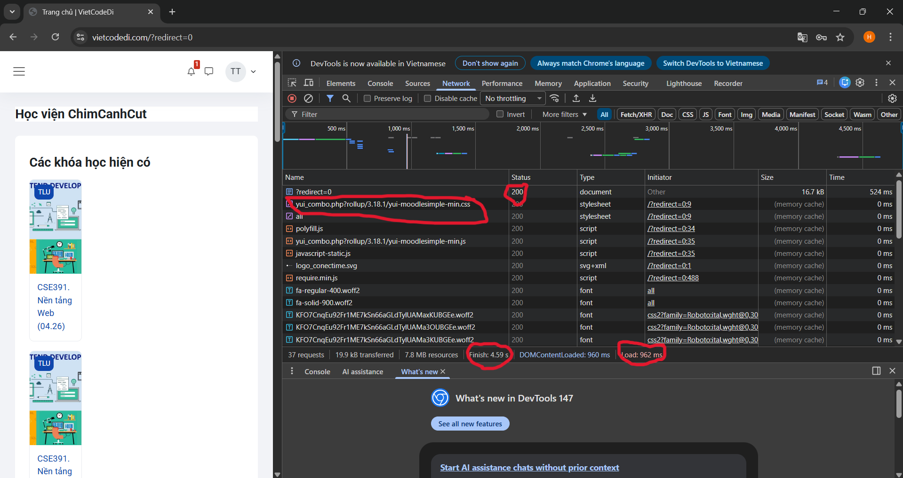

#### Câu A1 (Nguồn: 01_introduction_html_universe.md 1.1 Kiến trúc Client-Server, 1.2 HTTP, 1.3 Browser Rendering.)
1. Thứ tự ít nhất 5 bước khi gõ https://shopee.vn:
   - DNS lookup: Trình duyệt tra cứu địa chỉ IP của shopee.vn từ DNS server.
   - TCP connection: Thiết lập kết nối TCP với server.
   - HTTP request: Gửi GET request đến server.
   - Server processing: Server xử lý request, trả về HTML/CSS/JS.
   - Browser rendering: Parse HTML, load CSS/JS, render trang.
2. Trong DevTools của Chrome, tab Network cho thấy thông tin:
   - Mã trạng thái: Cho biết yêu cầu thành công (200) hay thất bại (404, 500).
   - Tổng thời gian: Thời gian để trang web tải hoàn tất.
   - Loại tệp: Phân biệt giữa file HTML, CSS, JavaScript hay hình ảnh.

   
   

#### Câu A2 (Nguồn: 04_visible_part_html.md)
- Trang web bị đánh giá SEO thấp vì:
  + dùng `<div class="header">` thay vì `<header>` cho phần đầu trang.
  + dùng `<div class="menu">` thay vì `<nav>` cho phần điều hướng.
  + dùng `<div class="main">` thay vì `<main>` cho phần nội dung chính.
  + dùng `<div class ="product">` thay vì `<article>` cho phần sản phẩm.
  + dùng `<div class="footer">` thay vì `<footer>` cho phần chân trang.
  
  => Google không hiểu cấu trúc.

#### Câu A3
[ Hộp 1 ] (div: là các phần tử khối => bắt đầu trên một dòng mới)
Text A Text B (span chiếm vừa đủ chiều ngang của nội dung, không làm ngắt dòng)
[ Hộp 2 ]
Text C Text D (text D in đậm(strong))
[ Hộp 3 ]

#### Câu A4
<thead>: tiêu đề cột
<tbody></tbody>: dữ liệu chính
<tfoot>: tổng kết
Lý do không nên dùng table để tạo layout cho trang web:
1. Không phải thẻ semantic => Google không hiểu cấu trúc.
2. Khó responsive(table khó co giãn linh hoạt theo màn hình)
3. Ảnh hưởng đến SEO (Screenreader sẽ hiểu nhầm là bảng dữ liệu)

#### Câu C1

```<header>
    <h1>THT Shop</h1>
    <nav aria-label="Main menu"> <ul>
            <li><a href="/">Trang chủ</a></li>
            <li><a href="/products">Sản phẩm</a></li>
        </ul>
    </nav>
</header>

<nav aria-label="breadcrumb"> <ol> <li><a href="/">Trang chủ</a></li>
        <li><a href="/mobile">Điện thoại</a></li>
        <li aria-current="page">iPhone 16</li>
    </ol>
</nav>

<main>
    <article> <section class="gallery"> <header><h3>Bộ sưu tập hình ảnh</h3></header>
            <figure> 
                
                
                
                
                <figcaption>Chi tiết thiết kế iPhone 16 mới nhất</figcaption>
            </figure>
        </section>

        <section class="product-info">
            <h2>iPhone 16 Pro Max</h2> <p class="price"><strong>Giá:</strong> 25.990.000đ</p>
            <p class="rating"><strong>Đánh giá:</strong> 5.0 / 5 ⭐</p>
            <p class="desc">Mô tả ngắn: Chip A18 Pro, màn hình OLED 120Hz...</p>
        </section>

        <section class="specs">
            <h3>Thông số kỹ thuật</h3>
            <table border="1"> <thead>
                    <tr>
                        <th>Đặc tính</th> <th>Thông tin chi tiết</th>
                    </tr>
                </thead>
                <tbody>
                    <tr>
                        <td>Màn hình</td>
                        <td>6.3 inch Super Retina XDR</td> </tr>
                </tbody>
            </table>
        </section>

        <section class="reviews">
            <h3>Bình luận từ người mua</h3>
            <article> <strong>Tạ Hoàng Thương:</strong>
                <blockquote>Máy dùng rất mượt, giao hàng siêu nhanh!</blockquote> </article>
        </section>
    </article>

    <aside> <h3>Sản phẩm tương tự</h3>
        <ul>
            <li><a href="/s24">Samsung Galaxy S24 Ultra</a></li>
            <li><a href="/pixel9">Google Pixel 9 Pro</a></li>
        </ul>
    </aside>
</main>

<footer>
    <p>&copy; 2026 THT Shop - All rights reserved.</p>
</footer>
```

#### Câu C2
Việc cho rằng chỉ cần dùng `<div>` và đặt tên lớp (class) là đủ là một tư duy phiến diện, chỉ nhìn thấy sự tiện lợi nhất thời mà bỏ qua những giá trị cốt lõi của phát triển Web bền vững. Dưới đây là những lý do tại sao HTML ngữ nghĩa là bắt buộc:
- Tối ưu hóa công cụ tìm kiếm (SEO): Google Bot và các công cụ tìm kiếm không hiểu được ý nghĩa của các tên lớp do chúng ta tự đặt (ví dụ: `<div class="tieude">`). Thay vào đó, chúng tìm kiếm các thẻ như `<h1>`, `<header>` ,hay `<article>` để xác định cấu trúc dữ liệu quan trọng nhất. Nếu chỉ dùng `<div>`, trang web sẽ trở thành một "vùng đất bằng phẳng" không có điểm nhấn, khiến khả năng xếp hạng tìm kiếm bị giảm sút nghiêm trọng.
- Khả năng tiếp cận (Accessibility): Đây là trách nhiệm đạo đức và kỹ thuật. Những người khiếm thị sử dụng phần mềm đọc màn hình (Screen Readers) dựa vào các thẻ ngữ nghĩa để điều hướng. Khi gặp thẻ `<nav>`, máy sẽ báo "Đây là menu"; khi gặp <main>, máy sẽ nhảy thẳng đến nội dung chính. Một trang web toàn `<div>` sẽ khiến họ hoàn toàn lạc lối vì máy không thể hiểu cấu trúc của nó.

#### Câu B3
- Lỗi 1: Dòng 1 - Thiếu html trong DOCTYPE - Thêm html sau DOCTYPE.
- Lỗi 2: Dòng 2 - Thiếu language, thêm lang = "vi" - Thêm lang = "vi".
- Lỗi 3: Dòng 4 - Title chưa đóng - Thêm `</title>` sau Trang web.
- Lỗi 4: Dòng 5 - charset sai phải là UTF-8.
- Lỗi 5: Dòng 6 - Thiếu meta viewport - Thêm `<meta name="viewport" content="width=device-width, initial-scale=1.0">`.
- Lỗi 6: Dòng 8 - Thẻ đóng h1 thiếu / - Thêm "/" vào thẻ đóng h1.
- Lỗi 7: Dòng 12 - Thẻ đóng a thiếu / - Thêm "/" vào thẻ đóng a.
- Lỗi 8: Dòng 20 - Thiếu "" ở src và thiếu alt - Sửa thành: ``.
- Lỗi 9: Dòng 22 - Thẻ `<p>` phải đóng ngoài cùng. Thẻ `<b>` đóng sai và ko phải thẻ semantic, đổi thành `<strong>` - Sửa: `<p>Giá: <strong>25.990.000đ</strong></p>`.
- Lỗi 10: Dòng 28-35 - Thiếu thead, tbody - Đóng lại thead ở 28 và 31, tbody ở 32 và 35.
- Lỗi 11: - Dòng 40 - Thừa main - Sửa:
   ```
   <aside>
        <p>Sidebar content</p>
   </aside>
   ```
- Lỗi 12: Dòng 45 - Thẻ đóng p thiếu / - Thêm "/" vào thẻ đóng p.
